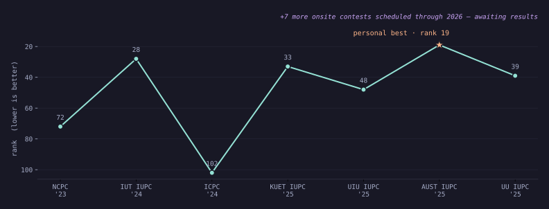
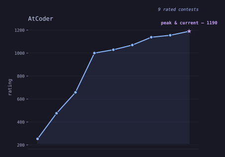

  

 

Competitive programmer chasing Candidate Master on Codeforces, currently teaching IUT's next onsite batch the same DP and graph theory that got me here. Between contests I'm usually deep in a Raspberry Pi Pico project, holding a plank for a planche, or trying to read Arabic faster than I debug a segfault.

 

### Track record

<table>
<tr>
<td width="50%"></td>
<td width="50%"></td>
</tr>
</table>

Both rendered straight from data — <code>data/onsite_contests.csv</code> and a live AtCoder fetch. Neither is a curated highlight reel.

  

**Highlights**
- Codeforces Expert, peak rating 1692, 230+ problems solved on CSES
- 12+ inter-university onsite contests for IUT, personal-best rank 19 of 150 teams (AUST IUPC, 2025)
- Instructor, IUTPC — DP, graph theory, and data structures for 50+ freshers a year
- Software sub-team, Project Altair (IUT Mars Rover) — ROS-based automation pipeline
- 3x national qualifier, Bangladesh Math Olympiad, Divisional Champion 2018

 

 

**Off the clock** — full planche, front lever, one-arm pull-up progression, 90 degree push-ups, MMA & Taekwondo, a 14.41s cube solve, sketching and origami, and slowly getting fluent in Arabic (Modern Standard).

 

Generated from <code>data/</code> · last updated 2026-08-25

