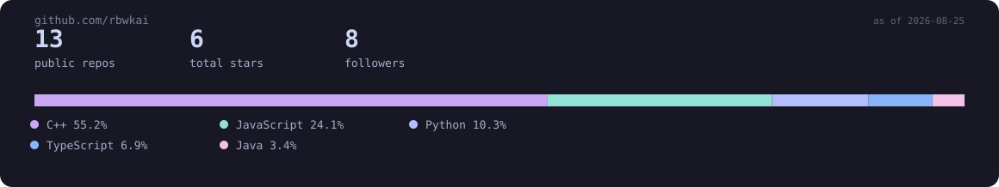

<a href="https://github.com/rbwkai">GitHub</a> ·
<a href="https://linkedin.com/in/mahiulkabir">LinkedIn</a> ·
<a href="https://codeforces.com/profile/rbwkai">Codeforces</a> ·
<a href="https://atcoder.jp/users/rbwkai">AtCoder</a> ·
<a href="https://picoctf.org/users/rbwkai">picoCTF</a> ·
<a href="https://instagram.com/rbwkai">Instagram</a> ·
<a href="mailto:mahiulkabir@iut-dhaka.edu">Email</a>

 

Competitive programmer chasing Candidate Master on Codeforces, currently teaching IUT's next onsite batch the same DP and graph theory that got me here. Between contests I'm usually deep in a Raspberry Pi Pico project, holding a plank for a planche, or trying to read Arabic faster than I debug a segfault.

 

  

### Onsite track record

Rendered from <code>data/onsite_contests.csv</code> — this is a live log, not a highlight reel.

  

**Highlights**
- Codeforces Expert, peak rating 1692, 230+ problems solved on CSES
- 12+ inter-university onsite contests for IUT, personal-best rank 19 of 150 teams (AUST IUPC, 2025)
- Instructor, IUTPC — DP, graph theory, and data structures for 50+ freshers a year
- Software sub-team, Project Altair (IUT Mars Rover) — ROS-based automation pipeline
- 3x national qualifier, Bangladesh Math Olympiad, Divisional Champion 2018

 

 

Generated from <code>data/</code> · last updated 2026-08-25

